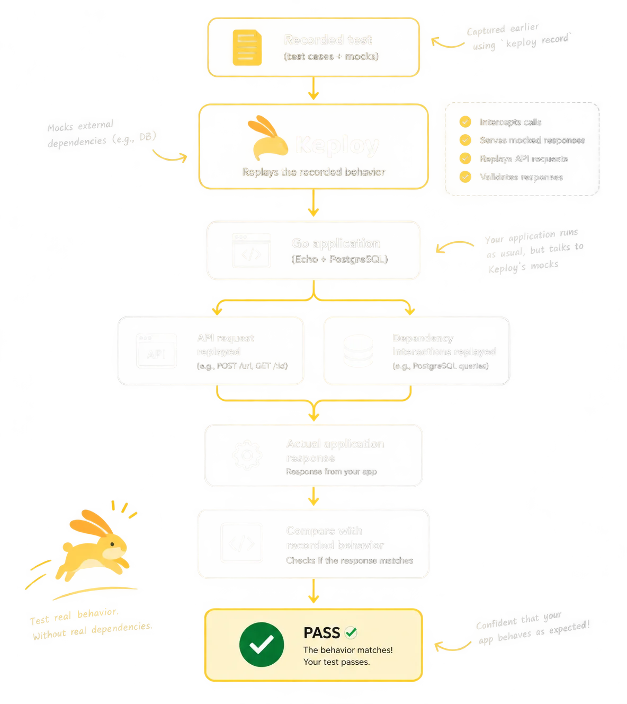

<div align="center">

# Keploy × Go Tutorial Platform

**A modern, interactive technical documentation and tutorial platform demonstrating zero-code API test generation with Keploy, Go (Echo), and PostgreSQL.**

[](https://gokeploy.vercel.app/)
[](https://nextjs.org/)
[](https://react.dev/)
[](https://tailwindcss.com/)
[](https://www.typescriptlang.org/)
[](LICENSE)

<br />



</div>

---

## 📖 About The Project

This documentation application is a hands-on, interactive tutorial designed to guide Go developers through testing distributed applications without manually writing test mocks or maintaining test databases.

Built around Keploy's **`echo-sql`** sample (a URL shortener service built with the **Echo** web framework and **PostgreSQL**), the tutorial provides an end-to-end walkthrough of:
1. Capturing real API calls and wire-level SQL exchanges during runtime (`keploy record`).
2. Persisting test assertions and database mocks as deterministic YAML fixtures.
3. Replaying captured interactions hermetically without external dependencies (`keploy test`).

The site is built with **Next.js 16 App Router**, **MDX**, and **Tailwind CSS 4**, delivering a fast, static documentation experience with dark mode persistence and interactive architecture diagrams.

---

## ✨ Key Features

### 🛠️ Hands-On Development Workflows
- **Process 1: Docker Compose Workflow** — Complete containerized development setup running both the Echo service and PostgreSQL within Docker network namespaces.
- **Process 2: Local Linux/WSL Workflow** — Local native binary compilation (`go build`) with containerized PostgreSQL and kernel-level eBPF socket interception (`sudo -E PATH=$PATH`).
- **Deep-Dive Replay Architecture** — Dedicated 7-stage architectural breakdown explaining how Keploy intercepts network packets and mocks databases at the wire level.

### 💻 Developer Experience & Interactive UI
- **Syntax-Highlighted Terminal Panels**: Pre-baked dual-theme code blocks (powered by [Shiki](https://shiki.style/)) with copy-to-clipboard actions and prompt gutters (`$`).
- **Interactive Component Bindings**: Custom React components embedded directly in MDX:
  - `<NetworkArchitecture />`: Visual comparison of container DNS resolution vs. host loopback addressing.
  - `<TestMockComparison />`: Interactive viewer comparing inbound HTTP test contracts with database mock outputs.
- **Responsive Table of Contents**: Sticky sidebar navigation with real-time scroll-spy tracking and mobile drawer support.
- **System-Aware Theming**: Instant light and dark mode toggling using CSS variables and `next-themes` with zero layout shift.

---

## 🏗️ Replay Architecture Overview

```text
       ┌────────────────────────┐
       │   Recorded Test Data   │
       │ (HTTP Tests + DB Mocks)│
       └───────────┬────────────┘
                   │
                   ▼
       ┌────────────────────────┐
       │     Keploy Engine      │
       │ (Network Interception) │
       └─────┬────────────▲─────┘
Replays HTTP │            │ Serves Mocks
Calls        ▼            │ (No Live DB)
       ┌────────────────────────┐
       │     Go Application     │
       │  (Echo + PostgreSQL)   │
       └───────────┬────────────┘
                   │
                   ▼
       ┌────────────────────────┐
       │   Compare Responses    │
       │   (PASS / Regression)  │
       └────────────────────────┘
```

During test replay (`keploy test`), Keploy acts as both an HTTP client and a mock dependency server. When the Go application queries PostgreSQL, Keploy intercepts the outgoing TCP connection at the socket level and returns the exact pre-recorded SQL response—eliminating database spin-up, migration, and teardown overhead.

---

## 🧰 Tech Stack

| Category | Technology | Description |
|---|---|---|
| **Framework** | [Next.js 16.3.4](https://nextjs.org/) | App Router with Turbopack for static generation |
| **Language** | [TypeScript 5](https://www.typescriptlang.org/) | Strict typechecking across components and data schemas |
| **Content** | [MDX 3](https://mdxjs.com/) | Markdown with embedded React components via `@next/mdx` |
| **Styling** | [Tailwind CSS 4](https://tailwindcss.com/) | Modern CSS-first styling using `@tailwindcss/postcss` |
| **Primitives** | [shadcn/ui](https://ui.shadcn.com/) / [Radix UI](https://www.radix-ui.com/) | Accessible primitives (Dialog, Tabs, Tooltip, Alert) |
| **Syntax Highlighting** | [Shiki 4](https://shiki.style/) | Build-time syntax highlighting for dual light/dark themes |
| **Icons** | [Lucide React](https://lucide.dev/) | Consistent iconography across headers, callouts, and UI |

---

## 🚀 Getting Started

### Prerequisites

Ensure you have the following installed on your machine:
- **Node.js**: `v20.0.0` or later
- **npm**: `v10.0.0` or later
- **Git**

### Installation

1. Clone the repository:
   ```bash
   git clone https://github.com/INdrajit88/GO-TUTORIAL.git
   cd GO-TUTORIAL
   ```

2. Install dependencies:
   ```bash
   npm install
   ```

### Running Locally

Launch the local development server:
```bash
npm run dev
```

Visit [http://localhost:3000](http://localhost:3000) in your browser.

---

## 📜 Available Scripts

| Script | Command | Purpose |
|---|---|---|
| `npm run dev` | `next dev` | Starts development server with Turbopack |
| `npm run build` | `next build` | Compiles optimized static production build |
| `npm run start` | `next start` | Runs the locally built production application |
| `npm run lint` | `eslint` | Runs ESLint analysis across TypeScript and MDX |
| `npm run typecheck` | `tsc --noEmit` | Performs strict TypeScript type checks |

---

## 📂 Project Structure

```text
├── app/
│   ├── layout.tsx              # Root layout with Geist fonts, metadata, and theme provider
│   ├── page.mdx                # Core tutorial documentation written in MDX
│   ├── globals.css             # Theme tokens, custom prose styles, and code chrome
│   ├── robots.ts               # Robots.txt crawler configuration
│   └── sitemap.ts              # Dynamic sitemap generator
├── components/
│   ├── ui/                 # shadcn/ui primitives (Button, Alert, Tabs, Badge)
│   ├── Callout.tsx             # Contextual note panels (tip, info, warning)
│   ├── CommandBlock.tsx        # Shell command container with prompt decoration
│   ├── TerminalBlock.tsx       # Highlighted code output with copy-to-clipboard
│   ├── Screenshot.tsx          # Responsive figure component with fallback handling
│   ├── TableOfContents.tsx     # Sticky sidebar TOC with scroll-spy observer
│   ├── NetworkArchitecture.tsx # Interactive Docker networking architecture diagram
│   ├── TestMockComparison.tsx  # Interactive test vs. mock YAML schema comparison
│   ├── SiteHeader.tsx          # Navigation header with branding and theme toggle
│   └── SiteFooter.tsx          # Site footer with resource links
├── content/
│   └── tutorialData.ts         # Structured data models, commands, and TOC items
├── lib/
│   ├── slug.ts                 # Pure slugification utilities for anchor IDs
│   └── utils.ts                # Tailwind class merge utility (cn)
├── public/
│   ├── keploy-logo.png         # Keploy bunny brand mark
│   └── screenshots/            # Compressed WebP diagrams and terminal captures
├── mdx-components.tsx          # Global component bindings for MDX elements
├── next.config.ts              # Next.js and MDX compiler settings
├── package.json                # Dependencies and project scripts
└── tsconfig.json               # TypeScript compiler configuration
```

---

## 🚢 Deployment

The documentation site is optimized for static deployment on **Vercel**. Every commit pushed to the `main` branch automatically triggers a production build and deployment.

### Deploy Your Own Copy

[](https://vercel.com/new/clone?repository-url=https://github.com/INdrajit88/GO-TUTORIAL)

1. Connect your GitHub repository to Vercel.
2. Select the **Next.js** framework preset.
3. Build command: `next build` (default).
4. Output directory: `.next` (default).

---

## 🤝 Contributing

Contributions are welcome! If you notice an error in the tutorial, want to add additional test scenarios, or have ideas for improving the interactive components:

1. Fork the repository.
2. Create a feature branch (`git checkout -b feature/amazing-feature`).
3. Commit your changes (`git commit -m 'feat: add amazing feature'`).
4. Push to the branch (`git push origin feature/amazing-feature`).
5. Open a Pull Request.

---

## 📄 License

This project is open source and available under the [MIT License](LICENSE).
